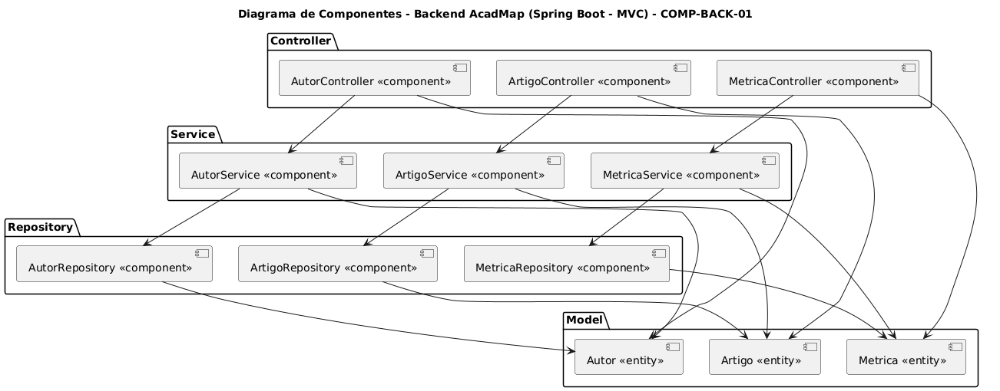
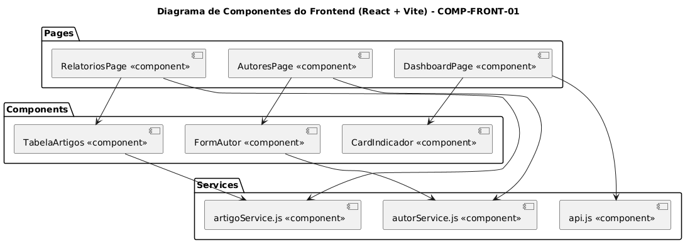

# 5.1 Visão Lógica

A Visão Lógica descreve a estrutura interna do sistema, representando os principais pacotes, camadas e dependências entre componentes de software. Essa visão está dividida em duas partes, conforme os dois grandes blocos tecnológicos da solução: o backend, implementado em Java com Spring Boot, e o frontend, desenvolvido com React e empacotado via Vite.

Ambas as camadas seguem boas práticas de engenharia, com foco em separação de responsabilidades, clareza de código e facilidade de manutenção. Os diagramas a seguir representam as estruturas propostas e seus relacionamentos internos.

---

## 5.1.1 Backend (Spring Boot - MVC)

A camada backend adota uma arquitetura monolítica com padrão **MVC (Model-View-Controller)**, sem modularização por domínio. O código é organizado em pacotes que refletem as camadas de controle (Controller), serviço (Service), persistência (Repository) e modelo de domínio (Model).

Essa organização visa garantir clareza e manutenção simples, permitindo o crescimento gradual do sistema. Cada entidade do domínio é representada por um modelo, e manipulada por seus respectivos controladores, serviços e repositórios.

### Diagrama de Componentes do Backend - COMP-BACK-01
```mermaid
graph TD
  subgraph controller
    A[AutorController]
    B[ArtigoController]
    C[MetricaController]
  end

  subgraph service
    D[AutorService]
    E[ArtigoService]
    F[MetricaService]
  end

  subgraph repository
    G[AutorRepository]
    H[ArtigoRepository]
    I[MetricaRepository]
  end

  subgraph model
    J[Autor]
    K[Artigo]
    L[Metrica]
  end

  A --> D
  B --> E
  C --> F

  D --> G
  D --> J
  E --> H
  E --> K
  F --> I
  F --> L

  A --> J
  B --> K
  C --> L

  G --> J
  H --> K
  I --> L
```

Clique nos blocos abaixo para visualizar versões em outros formatos:

??? note "Versão PlantUML"
    ```plantuml
    @startuml
    title Diagrama de Componentes - Backend AcadMap (Spring Boot - MVC) - COMP-BACK-01

    package "Controller" {
      [AutorController <<component>>] as AC
      [ArtigoController <<component>>] as ARC
      [MetricaController <<component>>] as MC
    }

    package "Service" {
      [AutorService <<component>>] as AS
      [ArtigoService <<component>>] as ARS
      [MetricaService <<component>>] as MS
    }

    package "Repository" {
      [AutorRepository <<component>>] as AR
      [ArtigoRepository <<component>>] as ARR
      [MetricaRepository <<component>>] as MR
    }

    package "Model" {
      [Autor <<entity>>] as A
      [Artigo <<entity>>] as ART
      [Metrica <<entity>>] as M
    }

    AC --> AS
    ARC --> ARS
    MC --> MS

    AS --> AR
    AS --> A
    ARS --> ARR
    ARS --> ART
    MS --> MR
    MS --> M

    AC --> A
    ARC --> ART
    MC --> M

    AR --> A
    ARR --> ART
    MR --> M
    @enduml
    ```
??? note "Versão .png"
    


---

## 5.1.2 Frontend (React + Vite)

A camada frontend é implementada com React e Vite, utilizando o paradigma de componentização funcional. A aplicação é organizada em três principais diretórios lógicos:

  * `pages/`: Define as páginas da aplicação vinculadas às rotas principais.
  * `components/`: Contém componentes reutilizáveis que compõem visualmente as páginas.
  * `services/`: Abstrai a comunicação com a API REST do backend, utilizando axios ou fetch.

Essa organização permite alta reutilização, facilidade de testes e separação de responsabilidades. O fluxo de dados se baseia em props e hooks do React.

```mermaid
graph TD
  subgraph pages
    A[DashboardPage]
    B[RelatoriosPage]
    C[AutoresPage]
  end

  subgraph components
    D[CardIndicador]
    E[TabelaArtigos]
    F[FormAutor]
  end

  subgraph services
    G[api.js]
    H[artigoService.js]
    I[autorService.js]
  end

  A --> D
  B --> E
  C --> F

  A --> G
  B --> H
  C --> I

  E --> H
  F --> I
```

Clique nos blocos abaixo para visualizar versões em outros formatos:

??? "Versão PlantUML"
    ```
      @startuml
      title COMP-FRONT-01 – Diagrama de Componentes do Frontend (React + Vite)

      package "Pages" {
        [DashboardPage <<component>>] as DP
        [RelatoriosPage <<component>>] as RP
        [AutoresPage <<component>>] as AP
      }

      package "Components" {
        [CardIndicador <<component>>] as CI
        [TabelaArtigos <<component>>] as TA
        [FormAutor <<component>>] as FA
      }

      package "Services" {
        [api.js <<component>>] as API
        [artigoService.js <<component>>] as ARTAPI
        [autorService.js <<component>>] as AUTAPI
      }

      ' Páginas usam componentes
      DP --> CI
      RP --> TA
      AP --> FA

      ' Páginas consomem serviços
      DP --> API
      RP --> ARTAPI
      AP --> AUTAPI

      ' Componentes também podem consumir serviços
      TA --> ARTAPI
      FA --> AUTAPI

      @enduml
    ```

??? "Versão .png"
    

